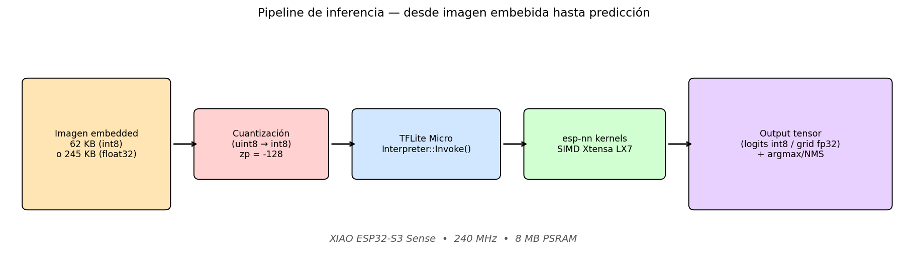
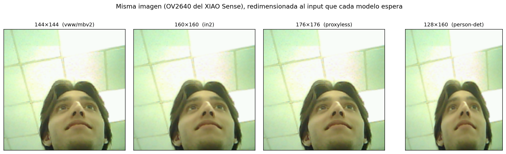
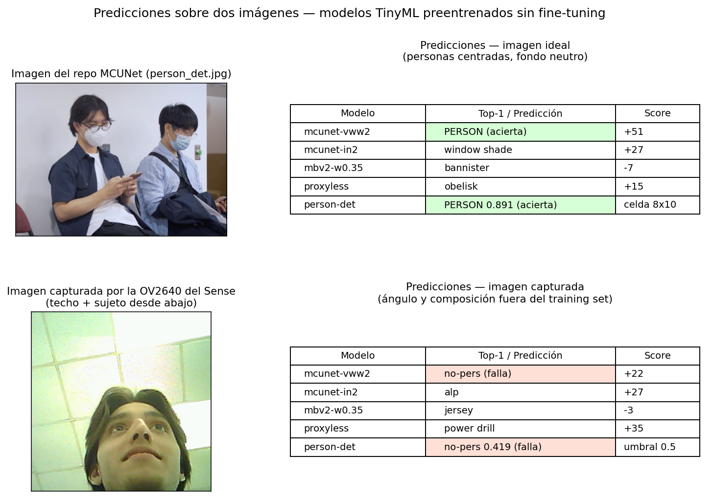
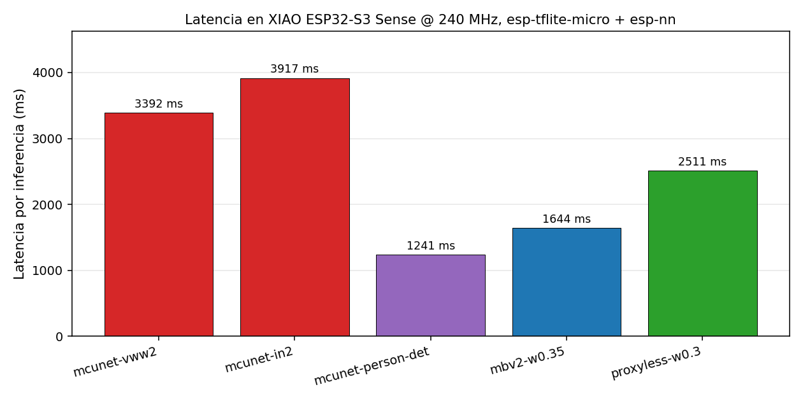
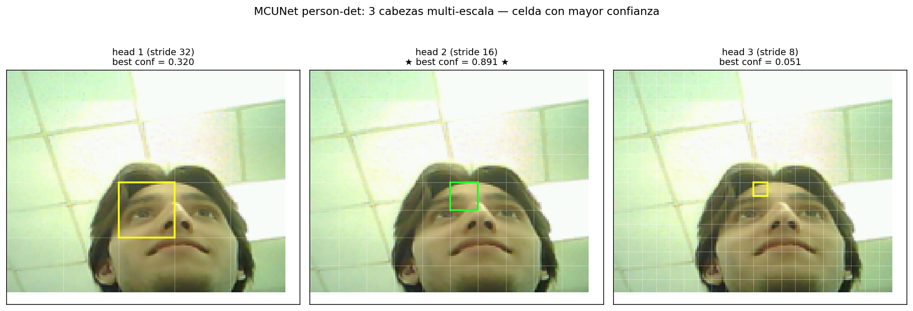
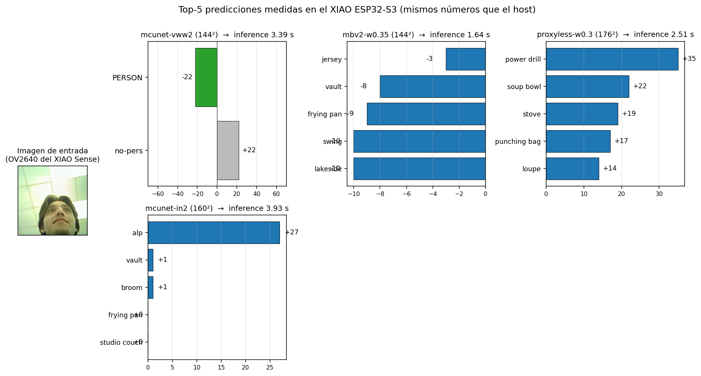
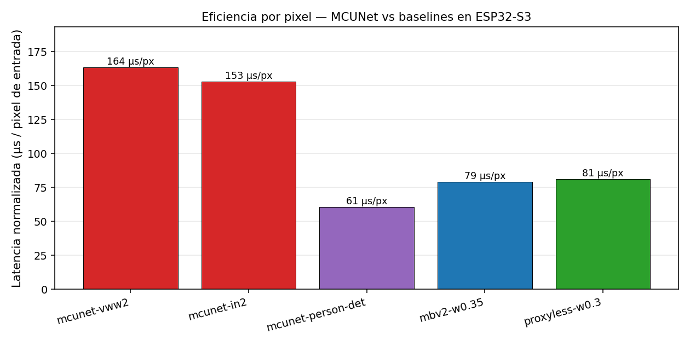
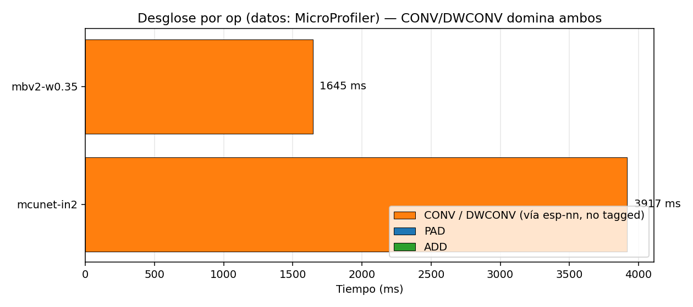
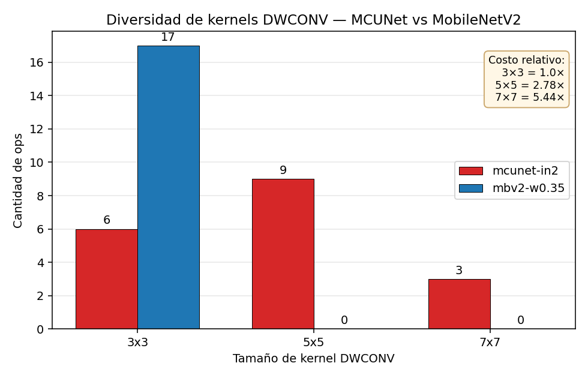

# MCUNet en ESP32-S3: reporte ejecutivo

**Autor**: José Luis Domínguez Morales · **Fecha**: 22 de mayo de 2026 · **Plataforma**: XIAO ESP32-S3 Sense

---

## 1. Pregunta del experimento

¿Es viable usar los modelos [MCUNet (MIT Han Lab)](https://github.com/mit-han-lab/mcunet) — una familia de redes neuronales generadas por NAS y publicadas como estado del arte en TinyML — sobre un ESP32-S3?

MCUNet logra >70% top-1 en ImageNet con ~320 KB de SRAM. Los números del paper están medidos sobre **TinyEngine**, su motor de inferencia C/C++ co-diseñado, que sólo soporta ARM Cortex-M (STM32). El experimento evalúa MCUNet sobre un chip Xtensa LX7 (ESP32-S3) usando el ecosistema estándar de Espressif: `esp-tflite-micro` + `esp-nn`.

## 2. Qué se hizo

Cinco modelos `.tflite` preentrenados de MCUNet fueron descargados de los releases oficiales y desplegados en una Seeed XIAO ESP32-S3 Sense (Xtensa LX7 dual @ 240 MHz, 8 MB PSRAM, 8 MB flash):

| Modelo | Tarea | Input | Tamaño |
|---|---|---|---|
| `mcunet-vww2` | Visual Wake Words (persona/no) | 144×144 RGB int8 | 941 KB |
| `mcunet-in2` | ImageNet 1000 clases | 160×160 RGB int8 | 1010 KB |
| `mcunet-person-det` | Detector multi-escala (3 cabezas) | 128×160 fp32 | 296 KB |
| `mbv2-w0.35` (baseline) | ImageNet 1000 clases | 144×144 RGB int8 | 990 KB |
| `proxyless-w0.3` (baseline) | ImageNet 1000 clases | 176×176 RGB int8 | 992 KB |

Cada uno fue validado en el host con un intérprete TFLite, compilado en un proyecto ESP-IDF v5.2 independiente, flasheado al XIAO, y medido durante ≥10 inferencias consecutivas. Las salidas se compararon bit-a-bit entre host y dispositivo. Posteriormente se instrumentó `imagenet_demo` y `benchmark_mbv2` con `tflite::MicroProfiler` para obtener el desglose de tiempo por operación.

## 3. Resultados

### 3.1 Pipeline e imagen procesada

Se evalúa cada modelo sobre dos imágenes para medir generalización:

- **Imagen ideal**: `person_det.jpg` del repo MCUNet. Personas centradas, fondo neutro, iluminación uniforme. Es el tipo de imagen sobre el que los modelos fueron evaluados durante training y publicación.
- **Imagen real**: frame capturado por la cámara OV2640 del Sense durante este experimento. Composición natural (techo dominante, sujeto desde abajo, iluminación cenital).





### 3.2 Robustez out-of-distribution



Los mismos cinco modelos sobre las dos imágenes:

| Modelo | Imagen ideal | Imagen real (OV2640) |
|---|---|---|
| mcunet-vww2 | PERSON (+51) | no-pers (+22) |
| mcunet-in2 | "window shade" (+27) | "alp" (+27) |
| mbv2-w0.35 | "bannister" (-7) | "jersey" (-3) |
| proxyless-w0.3 | "obelisk" (+15) | "power drill" (+35) |
| mcunet-person-det | PERSON conf=0.891 | no-pers conf=0.419 |

El `mcunet-vww2` predice persona perfectamente sobre la imagen del repo, pero falla sobre una persona real fotografiada por la propia cámara del Sense. El detector queda a 0.081 del umbral 0.5. Los clasificadores ImageNet predicen objetos distintos entre las dos imágenes, ninguno relacionado con el sujeto (no existe una clase "persona" en ImageNet).

La diferencia se debe a las distintas distribuciones de orientación, iluminación y composición entre el conjunto de training y la imagen capturada en condiciones no controladas. Es un límite práctico relevante para cualquier uso en producción de estos modelos sin re-entrenamiento sobre la distribución de la aplicación.

### 3.3 Latencia absoluta



Las predicciones del XIAO coinciden con las del host TFLite en los cinco modelos: top-1 idéntico y scores int8 idénticos o con diferencias ≤1 LSB por desempate. Logs en [`docs/logs/`](logs/).

### 3.4 Detector multi-escala



Sobre la imagen del repo, la cabeza media (stride 16) detecta persona con confianza 0.891 sobre la celda que cubre cara/torso. Las otras dos cabezas dieron 0.320 y 0.051.

### 3.5 Top-5 por modelo (clasificadores)



### 3.6 Latencia normalizada por pixel



Normalizando por número de píxeles de entrada:

- MobileNetV2-w0.35 y ProxylessNAS-w0.3 son comparables (~80 µs/px).
- MCUNet (vww2 e in2) es ~2× más lento por pixel (~150 µs/px).
- `mcunet-person-det` es el más rápido (61 µs/px) pese a usar float32, porque sus weights son 3× más pequeños. Indica que el bottleneck es ancho de banda de memoria, no cómputo.

### 3.7 Profiling op-por-op



`MicroProfiler` reporta que >99.9% del tiempo está en CONV/DWCONV. Esos kernels son ejecutados por `esp-nn` (la librería SIMD de Espressif), que no emite eventos al profiler, lo que confirma que esp-nn está activo en ambos modelos. La diferencia de latencia está dentro de esp-nn.

### 3.8 Causa del slowdown



`esp-nn` está optimizado para DWCONV 3×3, el caso común de MobileNetV1/V2. Para 5×5 y 7×7 cae al path "generic depthwise conv".

| | mcunet-in2 | mbv2-w0.35 |
|---|---|---|
| DWCONV 3×3 | 6 | 17 (todos) |
| DWCONV 5×5 | 9 | 0 |
| DWCONV 7×7 | 3 | 0 |

El NAS de MCUNet eligió kernels grandes porque TinyEngine sí los acelera. En ESP32-S3 esa elección arquitectural se vuelve costo.

## 4. Conclusiones

1. Los modelos MCUNet corren correctamente sobre ESP32-S3 vía esp-tflite-micro. Los `.tflite` preentrenados son portables.
2. MCUNet pierde su ventaja sin TinyEngine: 2.4× más lento que MobileNetV2 a igual input.
3. La causa está cuantificada: el NAS de MCUNet produjo kernels DWCONV 5×5 y 7×7 que esp-nn no acelera con su fast-path SIMD.
4. Camino para acelerar MCUNet en ESP32-S3: re-correr TinyNAS con esp-nn como proxy de latencia, no TinyEngine. El NAS evitaría kernels grandes y produciría un modelo adaptado al runtime real del chip.
5. Existe una brecha de generalización medible: el mismo modelo que detecta personas en la imagen del repo no las detecta en una foto real tomada por la propia cámara del Sense. Estos modelos no son drop-in solutions para producción sin fine-tuning sobre la distribución de la aplicación.

## 5. Recomendaciones

- Para deployment en ESP32-S3 hoy: usar MobileNetV2 (variantes scaled de TFLite Hosted). Mejor latencia y soporte maduro.
- Para investigación en TinyML: el experimento abre dos líneas — co-diseño NAS + esp-nn; o port de TinyEngine a Xtensa (alto esfuerzo).
- Para usar MCUNet con su ventaja arquitectural: STM32H7 o Cortex-M55 (Grove Vision AI V2).

## 6. Entregables

```
README.md                  Setup y reproducción
docs/
  REPORT.md                este documento
  findings.md              tabla técnica completa
  CAMERA_FIX.md            procedimiento para destrabar la OV2640
  plots/                   9 plots PNG + frame capturado
  logs/                    capturas seriales como evidencia
firmware/
  vww_demo/                Visual Wake Words
  imagenet_demo/           ImageNet con mcunet-in2 + profiling
  person_detect_demo/      Detector multi-escala
  benchmark_mbv2/          MobileNetV2 baseline + profiling
  benchmark_proxyless/     ProxylessNAS baseline
  camera_test/             diagnóstico cámara
  i2c_scan/                sweep de bus I²C + chip ID
host/                      Scripts Python de conversión y validación
models/                    6 .tflite descargados
```

Nueve bugs no obvios resueltos durante el experimento están documentados en [`findings.md`](findings.md).
