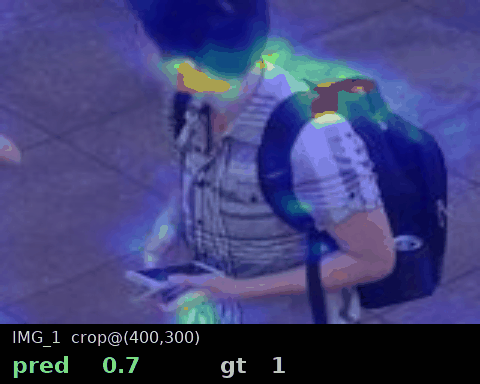
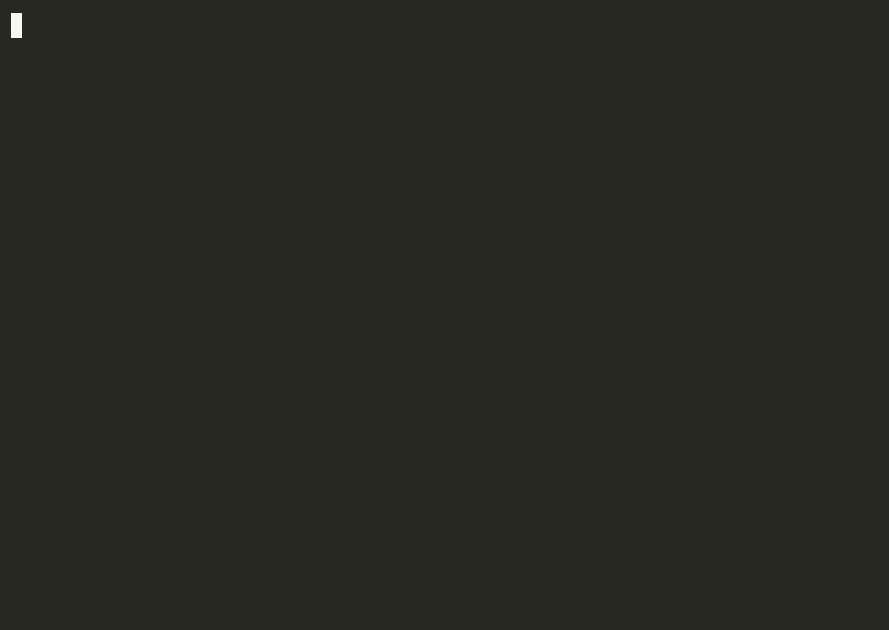

# geomcu_count

Firmware ESP-IDF para XIAO ESP32-S3 Sense que corre `microwd_paper`
(MiCrowdNet de `CentroFuturoCiudades/geomcu-counting`) cuantizado a int8.

Estado actual: **proof-of-concept single-patch**. El modelo se carga,
el arena cabe en PSRAM, la inferencia produce un density map coherente
con el host. Hay dos limitaciones que cierran la puerta a un demo
"imagen completa en vivo": latencia y rounding en kernels grandes.
Detalle abajo.



Ocho crops 128×160 sacados de imágenes ShanghaiTech Part B a su
resolución natural (= lo que vería un patch del tiling 8×8). Para cada
uno corre el mismo modelo TFLite int8 que está flasheado en el chip y
overlayea el density map sobre el input. `pred` es el sum del density
del modelo, `gt` es el número de puntos anotados del dataset que caen
en ese crop. Imágenes pickeadas del test set.



El monitor serial mientras la placa arranca, carga el modelo en el
arena de PSRAM y corre la inferencia. La latencia reportada (~47 s) y
el density sum coinciden con `firmware/geomcu_count/main/main.cc`.

## Lo que funciona

| | valor |
|---|---|
| Modelo embebido | `microwd_paper_logits_int8_patch_128x160.tflite` (158 KB) |
| Input por patch | 128×160×3 int8 (interior 96×128 + halo 16) |
| Output por patch | 32×40×1 int8 logits |
| Tensor arena | 6.3 MB usados / 7 MB reservados (PSRAM) |
| MAE host (50 imgs) | 14.55 vs PT 15.27 (el int8 actúa como regularizador suave) |

El softplus final NO va en el grafo TFLite. Los logits crudos se
cuantizan con buen rango int8, y `softplus(x) = log(1 + exp(x))` se
aplica en fp32 sobre los 1280 píxeles del output (despreciable). Esto
fue la diferencia entre MAE 53 (int8 con softplus interno, EXP/LOG
colapsa la resolución) y MAE 14.55 (logits_int8 + softplus post).

`MicroMutableOpResolver<5>`: `CONV_2D`, `DEPTHWISE_CONV_2D`,
`MAX_POOL_2D`, `ADD`, `CONCATENATION`. Sin EXP, sin LOG, sin LOGISTIC.

## Lo que no funciona bien

**Latencia: 47 segundos por patch**. El modelo usa DWConv con kernels
16×16, 13×13, 11×11. `esp-nn` solo tiene fast-path optimizado para
DWConv 3×3, así que estos kernels caen en la implementación de
referencia. Sobre el mismo chip con kernels chicos el MCUNet original
(mcunet-vww2, kernels 3-7) corre en 3.4 s. Con 8×8 tiling necesitamos
64 patches, lo que daría ~50 min por imagen completa. Impracticable
para un demo en vivo.

**Numérica chip vs host**. Sobre IMG_1 (resize 128×160):

| | chip | host |
|---|---:|---:|
| `density max` | 0.2686 | 0.2686 |
| `density sum_full` | 10.77 | 14.84 |
| `density sum_interior` | 3.77 | 8.05 |

El máximo coincide exactamente. La suma difiere ~30% por debajo. El
grafo, las escalas y el peak value se computan bien; pero `esp-nn` en
los DWConv grandes redondea con una regla ligeramente distinta al
reference kernel del TFLite host, y el sesgo se acumula. No es un
bug, es la implementación de fallback de `esp-nn` para tamaños fuera
de fast-path.

Para un deploy con accuracy production-grade habría que:

- Re-entrenar con kernels 3×3 puros (medio día en GPU, encaja en
  fast-path de esp-nn), o
- Pasar a Grove Vision AI V2 (Cortex-M55 + NPU Ethos-U55) que es
  target oficial de MCUNetV2 y maneja DWConv arbitrarios en hardware.

## Memoria

Primer intento usó tiling 4×4 con halo 32 (input 256×320). El planner
de TFLM Micro pidió 25.6 MB de arena, casi 4× los 8 MB de PSRAM. La
heurística empírica es ~313 bytes por pixel de input (es el peor caso
de la red con 4 ramas paralelas y `expansion=3`). Por eso bajamos a
8×8 tiling con halo 16 (input 128×160) que da arena 6.3 MB, dentro
del budget.

## Build, flash, monitor

```bash
source ~/esp/esp-idf/export.sh
cd firmware/geomcu_count

../../host/convert_to_c_array.sh \
    ~/work/geomcu-deploy/tflite/microwd_paper_logits_int8_patch_128x160.tflite \
    main/model_data.cc
python ../../host/image_to_c.py \
    ~/work/geomcu-deploy/dataset/part_B/test_data/images/IMG_1.jpg \
    160x128 main/test_image.cc g_test_patch

idf.py set-target esp32s3
idf.py -p /dev/ttyACM0 flash
python ../../host/monitor.py /dev/ttyACM0 60
```

El monitor tiene que correr al menos 50 s para capturar la inferencia
completa.

## Logs esperados

```
I geomcu: geomcu_count: MiCrowdNet logits_int8 single-patch proof
I geomcu: input 160x128 -> output 40x32 (stride 4)
I geomcu: model OK
I geomcu:   input  : 4 dims, shape=[1,128,160,3] dtype=9
I geomcu:   output : shape=[1,32,40,1] dtype=9
I geomcu:   arena  : used=6290 / 7168 KB
I geomcu:   in q   : scale=0.003922 zp=-128
I geomcu:   out q  : scale=0.058862 zp=127
I geomcu: Invoke OK, latency = 46630 ms
I geomcu: density: sum_full=10.7699  sum_interior=3.7736  max=0.2686
```

## Pipeline objetivo (no implementado)

```
imagen 768x1024 (PSRAM)
   │
   ├── tile 8x8, halo 16, edge-pad -> 64 patches 128x160
   │
   └── por cada patch:
         int8 quant ([-128, +127] vía scale 0.00392, zp -128)
         interpreter.Invoke()          (47 s con kernels grandes)
         dequant logits (scale 0.0589)
         softplus(logit) -> density 32x40 fp32
         recortar interior 24x32
         pegar en density_full 192x256

count = sum(density_full)
```

Implementarlo requiere primero acelerar el invoke. Sin eso, 64 patches
× 47 s = ~50 min por imagen, fuera de cualquier uso práctico.

## Detalle del experimento de cuantización

Está en `host/geomcu/README.md` y en `host/geomcu/convert_tflite.py`.
Cuatro variants de cuantización probados, el ganador `logits_int8`
es el que está embebido en este firmware.
